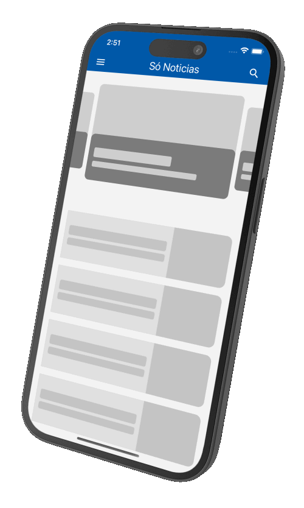

# APP NEWS Para WordPress

**APP NEWS Para WordPress** é um aplicativo de notícias desenvolvido para integrar com sites WordPress, oferecendo uma experiência de leitura de notícias otimizada para dispositivos móveis.



## Funcionalidades

- **Integração com WordPress:** Conecta-se facilmente a qualquer site WordPress para obter e exibir notícias.
- **Categorias e Tags:** Permite a navegação por categorias e tags para uma experiência de leitura mais organizada.
- **Notificações Push:** Envia notificações em tempo real para os usuários quando novas notícias são publicadas.
- **Leitura Offline:** Salva artigos para leitura offline.
- **Modo Escuro:** Suporte ao modo escuro para leitura confortável em ambientes com pouca luz.

## Funcionalidades Futuras

- **Notificações Push:** 🔔 Envia notificações em tempo real para os usuários quando novas notícias são publicadas.
- **Leitura Offline:** 📥 Salva artigos para leitura offline.
- **Modo Escuro:** 🌙 Suporte ao modo escuro para leitura confortável em ambientes com pouca luz.

## Requisitos

- Node.js
- React Native com Expo
- API REST do WordPress habilitada

## Tecnologias Utilizadas

- **React Native:** Framework para desenvolvimento de aplicativos móveis.
- **Expo:** Plataforma para facilitar o desenvolvimento e a construção de aplicativos React Native.
- **Axios:** Cliente HTTP para fazer requisições à API REST do WordPress.
- **React Navigation:** Biblioteca para navegação entre telas no aplicativo.

## Instalação

1. **Clone o repositório:**
   ```bash
   git clone https://github.com/raphaelvserafim/app-news-wpp.git
